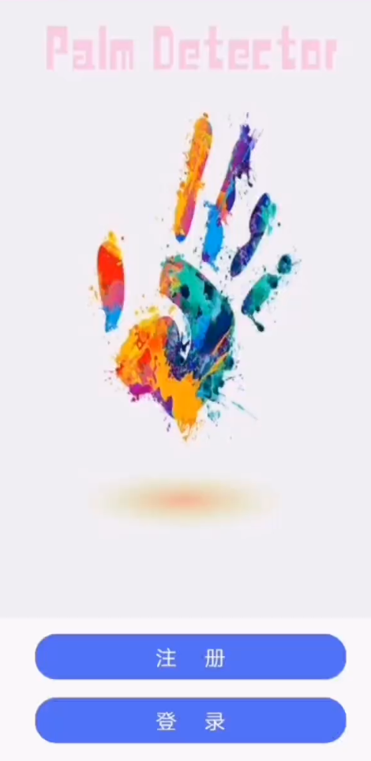
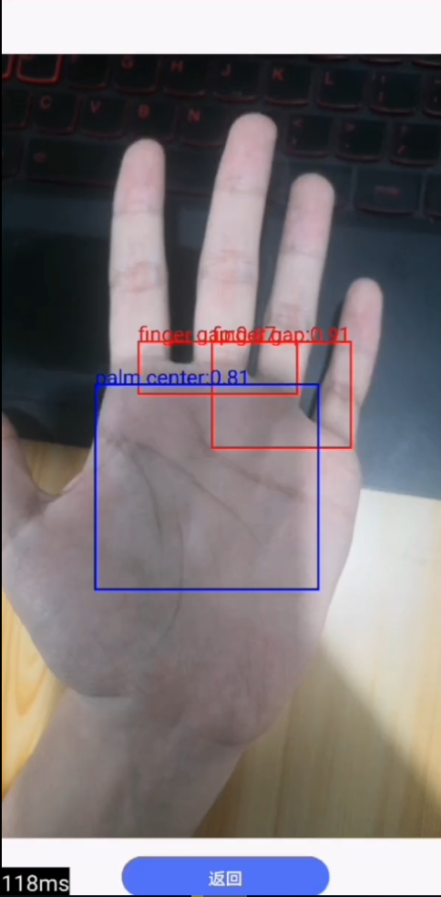

# Palm Detection

2022 Spring Tongji Computer Vision Course Project

## Method

1. Extract ROI —— Yolov5n (Run on Android Client)
2. Detect ROI —— MobileFaceNet (Run on Flask Server)

Paper: [Towards Palmprint Verification On Smartphones (arxiv.org)](https://arxiv.org/abs/2003.13266)

Flask Backend: [LinzhouLi/PalmDetection-backend (github.com)](https://github.com/LinzhouLi/PalmDetection-backend)

## Deploy Yolov5

**模型转换：**

1. 训练好的pytorch模型导出为torchscript
2. 使用[pnnx](https://github.com/pnnx/pnnx)将torchscript格式转换为NCNN格式

**图片预处理：**

1. Resize (转换宽高至 $320\times 32k$ 或 $32k\times320$, $k\in \mathbb{Z}$)
2. Padding (以114填充添加的部分)
3. Normalize (除以255)

**数据后处理：**

Anchor & NMS

参考 [nihui/ncnn-android-yolov5: The YOLOv5 object detection android example (github.com)](https://github.com/nihui/ncnn-android-yolov5)

## UI

